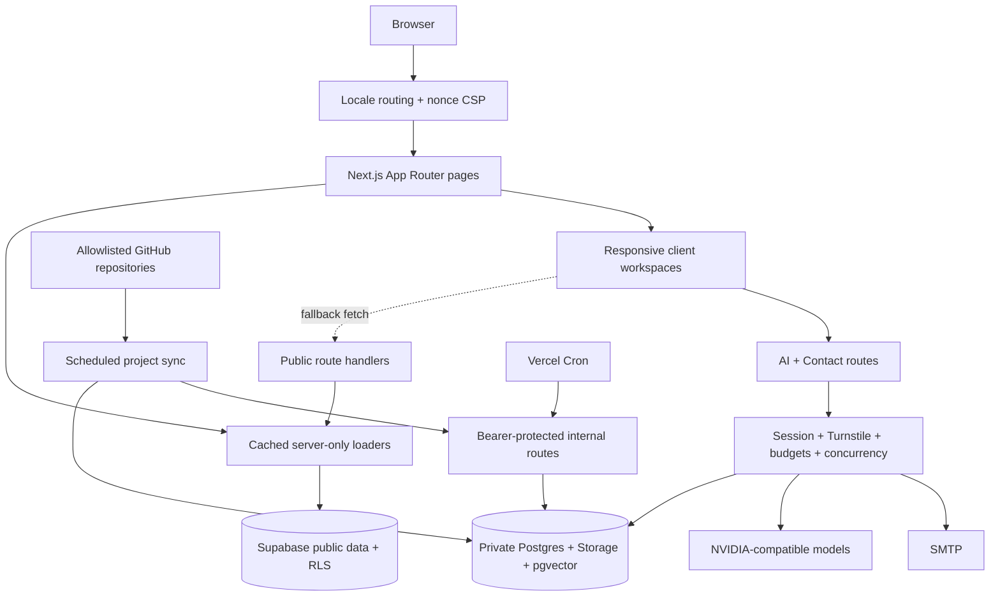

<p align="center">
  <a href="https://mouazdev.vercel.app">
    
  </a>
</p>

<h1 align="center">Mouaz Naji — Developer Portfolio</h1>

<p align="center">
  <strong>A full-stack portfolio designed as one connected GitHub- and Git-inspired developer workspace.</strong>
</p>

<p align="center">
  Repository paths, branches, commits, contribution activity, reviews, and clean status signals meet a responsive ocean-inspired visual identity.
</p>

<p align="center">
  <a href="https://mouazdev.vercel.app"><strong>Live portfolio</strong></a>
  &nbsp;·&nbsp;
  <a href="docs/README.md">Documentation</a>
  &nbsp;·&nbsp;
  <a href="docs/architecture.md">Architecture</a>
  &nbsp;·&nbsp;
  <a href=".github/SECURITY.md">Security</a>
</p>

<p align="center">
  <a href="https://github.com/Mouaz7/portfolio-/actions/workflows/ci-cd.yml">
    
  </a>
  
  
  
  
  
</p>

> [!NOTE]
> The complete portfolio concept is inspired by GitHub and Git—not only the Skills page. The implementation, visual identity, content, and responsive compositions are original and are not affiliated with or endorsed by GitHub.

---

## Explore the portfolio

The site presents Mouaz's work as a coherent developer environment instead of a collection of unrelated landing-page sections.

- **[Home](https://mouazdev.vercel.app/)** introduces the profile, roles, capabilities, selected work, and the protected CV download.
- **[Skills](https://mouazdev.vercel.app/skills-page)** organizes the technology stack into nine connected repository cards with branches, hashes, checks, contribution strips, `HEAD`, and self-hosted icons.
- **[Journey](https://mouazdev.vercel.app/journey)** renders education and professional experience as a chronological Git graph with lanes, commits, tags, verified states, and a current head.
- **[Projects](https://mouazdev.vercel.app/projects-page)** provides a searchable repository index with category tabs, language filters, sorting, visibility labels, and GitHub repository statistics.
- **[Code Review](https://mouazdev.vercel.app/code-review-page)** combines a pull-request-inspired editor, multilingual AI review, structured findings, and a contextual code/portfolio assistant.
- **[Contact](https://mouazdev.vercel.app/contact-page)** turns the contact flow into a repository and commit composer with Write/Preview, changed files, private attachments, status feedback, and SMTP delivery.

English is the canonical language. Swedish and Arabic use localized routes, translated content and metadata, language-aware formatting, and right-to-left layout where required.

## One GitHub/Git design language

GitHub and Git influence the information architecture as well as the visual details:

- repository ownership and visibility identify each workspace;
- branches and short hashes communicate position and history;
- commits, graphs, checks, contribution cells, and `HEAD` turn content into a timeline;
- repository search, language colors, stars, watchers, forks, and filters shape project discovery;
- review and commit workflows drive the Code Review and Contact interactions;
- clean, pending, verified, success, and failure states use familiar developer signals.

The Git-inspired structure is combined with Mouaz branding, a self-hosted Urbanist typeface, turquoise light/dark themes, and a shared animated ocean background. Desktop, tablet, and mobile layouts preserve the same concept without forcing one geometry onto every viewport.

Approved presentation is protected by source-level design locks and **36 visual baselines**: six public routes × three viewport classes × two themes.

## Key capabilities

### Server-first, responsive navigation

Skills, Journey, and Projects receive localized data directly from server-only loaders. When server preload is unavailable, the visible terminal stage accompanies a real client fallback request instead of hiding an artificial delay. Skills, Journey, Projects, and Code Review share the same readable Git terminal transition, while staged route prefetching keeps later navigation responsive.

Fixed visual stages are measured at most once per animation frame and scaled for the available viewport. Supported mobile views avoid unintended horizontal page overflow, preserve touch targets, and keep approved card and icon geometry intact.

### Animated background without blocking the interface

The shared background uses a theme-aware WebGL ocean shader. Desktop rendering moves to an `OffscreenCanvas` worker where supported; mobile uses a lighter analytic shader and reduced frame rate. Rendering pauses when hidden, coalesces resize and pointer updates, respects reduced motion, and falls back to CSS when WebGL or workers are unavailable.

### AI review and portfolio-grounded assistance

The Code Review workspace supports review, optimization, and security-focused analysis across multiple programming languages. Follow-up discussion remains grounded in the active review.

Its About mode uses Supabase pgvector retrieval over approved portfolio sources such as profile content, skills, journey entries, projects, and CV text. Weak and duplicate matches are filtered before bounded context reaches the configured NVIDIA-compatible model. Application code does not persist submitted code, review output, or chat conversations.

### Protected Contact and CV delivery

Contact supports up to five attachments through short-lived signed upload targets in private Supabase Storage. The server verifies the session, submission state, exact object manifest, actual byte totals, MIME types, and file signatures before taking a concurrency lease and atomically claiming a message for delivery. PDF, PNG, JPG/JPEG, WebP, and TXT are accepted up to a combined 10 MB.

The public `/api/cv` URL streams one configured private, versioned PDF. It validates the PDF signature and supports a strong ETag, `Last-Modified`, conditional `304` responses, and controlled browser/CDN caching.

### Safe project synchronization

The scheduled GitHub synchronization accepts repositories only from the configured owner, normalizes repository names and URLs case-insensitively, prevents casing or trailing-slash duplicates, updates Supabase through protected server access, and then revalidates Projects and refreshes the RAG index.

## Architecture



The application separates server data access, interactive presentation, privileged integrations, and public APIs. Supabase Row Level Security protects public reads; server-only admin access is reserved for Contact, CV, AI/RAG, synchronization, cleanup, and indexing operations.

Read [the architecture guide](docs/architecture.md) for routing, localization, rendering boundaries, data flow, caching, the Contact transaction, RAG indexing, security headers, and automation.

## Technology

- **Application:** Next.js 15 App Router, React 19, TypeScript 5
- **Interface:** Tailwind CSS 4, CSS Modules, Urbanist, Phosphor Icons
- **Graphics:** WebGL, Web Workers, `OffscreenCanvas`, responsive CSS stages
- **Data:** Supabase Postgres, Row Level Security, pgvector, private Storage
- **Integrations:** NVIDIA-compatible AI APIs, GitHub REST API, SMTP, Cloudflare Turnstile
- **Delivery:** Vercel Git deployments and GitHub Actions
- **Quality:** ESLint, TypeScript, Knip, Jest, React Testing Library, pgTAP, Playwright, axe, design lock, pixel lock, Lighthouse

## Security and privacy

- A server-only production validator fails closed when required security values are missing, too short, placeholder-like, or duplicated.
- Internal automation accepts only strict `Bearer <token>` authorization and uses timing-safe digest comparison.
- Public shallow health and authenticated backend health are separate endpoints with different cache policies.
- Supabase service credentials, AI keys, SMTP credentials, automation tokens, and security peppers never belong in client bundles.
- Request protection combines signed sessions, optional Turnstile verification, distributed budgets, concurrency limits, bounded request bodies, and controlled errors.
- Contact uses private uploads, exact manifest validation, sequential file verification, an atomic claim, replay protection, and cleanup.
- Security headers include a per-request nonce CSP, HSTS, frame denial, MIME sniffing protection, restrictive permissions, and cross-origin isolation controls.

Responsible disclosure instructions live in [`.github/SECURITY.md`](.github/SECURITY.md). Deeper implementation details are documented in [Architecture](docs/architecture.md) and [Database](docs/database.md).

## Getting started

### Requirements

- Node.js 22 or newer
- npm
- A Supabase project for dynamic data, private files, and RAG
- Chromium when running Playwright or Lighthouse locally
- Optional NVIDIA, Turnstile, and SMTP credentials for their related features

### Install and run

```bash
git clone git@github.com:Mouaz7/portfolio-.git
cd portfolio-
npm ci
cp .env.example .env.local
npm run dev
```

Fill in the environment values needed for the features you want to run, then open `http://localhost:3000`.

Use [`.env.example`](.env.example) as the maintained configuration reference. Real `.env*` files, credentials, private keys, and certificates must never be committed.

Production requires five independently generated and pairwise unique security values of at least 32 UTF-8 bytes:

- `RATE_LIMIT_PEPPER`
- `SESSION_COOKIE_SECRET`
- `CRON_SECRET`
- `RAG_JOB_SECRET`
- `REVALIDATE_SECRET`

Preview and Production should use different secret sets. Configure the private CV through `CV_STORAGE_BUCKET` and a version-named `CV_STORAGE_OBJECT`; see [CV setup](docs/cv-setup.md).

## Commands

```text
npm run dev               Start the development server
npm run build             Create a fail-closed production build
npm run start             Serve the production build
npm run lint              Run ESLint
npm run typecheck         Type-check without emitting files
npm run check:dead        Detect unused files, exports, and dependencies
npm run test              Run Jest in watch mode
npm run test:ci           Run Jest with CI coverage
npm run test:e2e          Run Playwright behavior and accessibility tests
npm run test:design-lock  Verify protected presentation source and assets
npm run test:pixel-lock   Compare all 36 approved screenshots
npm run test:lighthouse   Run three audits per public route and assert quality gates
npm run sync:projects     Synchronize allowlisted GitHub repositories
```

`sync:projects` requires its server-side Supabase credentials in the process environment. Do not place secret values directly in commands that can be retained by shell history.

## Quality and delivery

Every push and pull request targeting `main` runs the Quality workflow:

1. production and complete dependency audits;
2. ESLint, TypeScript, Knip, and the design lock;
3. Jest with coverage;
4. an isolated Supabase database and pgTAP security-policy tests;
5. a production build with independent CI-only security values;
6. Playwright behavior, accessibility, responsive-layout, and loader tests;
7. the 36-image exact/perceptual pixel lock;
8. three Lighthouse runs for each public route with category thresholds and median Web Vitals gates;
9. whitespace verification and short-lived diagnostic artifacts.

The Lighthouse gate requires performance ≥ 0.80, accessibility ≥ 0.90, best practices ≥ 0.90, SEO ≥ 0.90, median LCP ≤ 2.5 s, median TBT ≤ 250 ms, and median CLS ≤ 0.05. Vercel creates Production deployments from `main` and Preview deployments for non-production changes.

A separate scheduled workflow synchronizes allowlisted GitHub repositories, revalidates project data, and refreshes the RAG index. Dependency updates are reviewed and applied manually. The SHA-pinned CodeQL workflow analyzes JavaScript and TypeScript when repository visibility supports code scanning.

See [CI/CD](docs/cicd-pipeline.md), [Testing](docs/testing-guide.md), and [Deployment](docs/deployment.md) for operational details.

## Repository map

```text
app/             App Router pages, route handlers, metadata, styles, and fonts
components/      Feature UI, navigation, branding, loaders, and background
hooks/           Shared loading, viewport, and browser-state hooks
lib/             Data access, localization, AI, security, and integrations
public/          Brand, page imagery, project icons, and Skills icons
scripts/         Project sync, design lock, pixel lock, and Lighthouse tooling
supabase/        Migrations, local configuration, seed data, and pgTAP tests
__tests__/       Jest component, route, data, utility, and security tests
tests/e2e/       Playwright behavior, accessibility, viewport, and visual tests
docs/            Architecture, features, database, styling, testing, and delivery
```

## Documentation

- [Documentation hub](docs/README.md)
- [Architecture](docs/architecture.md)
- [Features](docs/features.md)
- [Database and Storage](docs/database.md)
- [Styling and responsive design](docs/styling.md)
- [Testing guide](docs/testing-guide.md)
- [CI/CD pipeline](docs/cicd-pipeline.md)
- [Deployment](docs/deployment.md)
- [Private CV setup](docs/cv-setup.md)

## License and asset rights

Copyright © 2026 Mouaz Naji. **All rights reserved.** This is proprietary source code and no license is granted to use, copy, modify, publish, distribute, sell, host, deploy, or create derivative works from this repository without prior written permission.

Making the repository public allows access and GitHub platform functionality under GitHub's Terms of Service, but it grants no additional permission to reuse its original code or material. Read the full [proprietary rights notice](LICENSE) and [asset rights](ASSETS_LICENSE.md). Third-party dependencies, fonts, icons, logos, and trademarks remain subject to their respective terms described in [THIRD_PARTY_NOTICES.md](THIRD_PARTY_NOTICES.md) and the [Skills icon source inventory](docs/skill-icon-sources.json).

<p align="center">
  <strong>Built by <a href="https://github.com/Mouaz7">Mouaz Naji</a></strong><br />
  GitHub structure · Git language · personal identity
</p>
