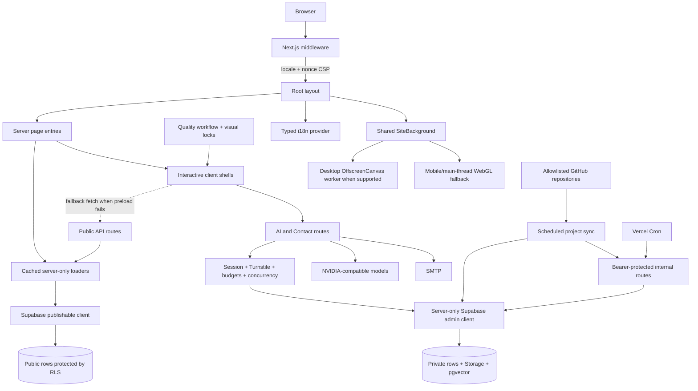
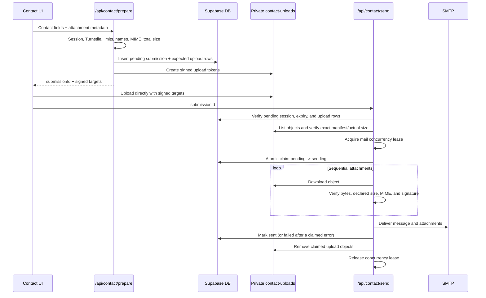

# Architecture

This portfolio is a Next.js 15 App Router application that combines server-first page rendering with interactive client presentation. Supabase provides public content, row-level security, private file storage, distributed request budgets, and the pgvector retrieval index. Server-only route handlers integrate NVIDIA-compatible AI services, SMTP, GitHub-derived data, and protected automation.

The UI is one responsive GitHub/Git-inspired workspace across Home, Skills, Journey, Projects, Code Review, and Contact. The application preserves that visual architecture with source design locks and 36 screenshot baselines.

## System overview



## Request lifecycle

### 1. Middleware and localization

`middleware.ts` runs for public page requests, excluding APIs and static assets. It has two responsibilities:

1. Generate a request nonce and attach a Content Security Policy to the request and response.
2. Resolve English, Swedish, or Arabic routing before the App Router renders.

English is canonical and unprefixed. `/en/...` redirects permanently to the matching unprefixed route. Swedish and Arabic use `/sv/...` and `/ar/...`; middleware rewrites those paths to the shared App Router page and passes the locale in `x-locale`. A first visit to `/` can redirect to the browser or saved preferred locale. The language choice is stored in a one-year `SameSite=Lax` cookie.

The root layout loads one typed dictionary, sets document `lang` and `dir`, and mounts `I18nProvider`. UI labels live in versioned TypeScript dictionaries. Editable page content uses the `content_translation` table with English/source fallback. Metadata, canonical URLs, `hreflang` alternatives, Open Graph locale, robots data, and sitemap entries are produced server-side.

See [ADR-001](architecture/adr-001-localized-routing-and-content.md) for the localization decision.

### 2. Root layout and global platform concerns

`app/layout.tsx` owns:

- localized global metadata and canonical site identity;
- the self-hosted Urbanist font;
- the nonce-bearing theme initialization script;
- the browser-extension compatibility script;
- safe DNS/preconnect hints for the configured Supabase origin;
- the shared `SiteBackground` behind every route;
- the typed localization provider;
- Vercel Speed Insights only when running on Vercel.

The document uses a fixed viewport shell. Each page owns its internal responsive composition and scroll behavior rather than allowing accidental body overflow.

### 3. Server-first page rendering

Page entries preload localized data directly through server-only loaders. They do not call their own public HTTP APIs during a successful server render.

| Page | Server preload | Client fallback |
| --- | --- | --- |
| Home | `getHomeContent(locale)` | Public Home data route where needed. |
| Skills | `getSkillCategories(locale)` and `getSkills()` | `/api/skill-categories?locale=...` and `/api/skills`. |
| Journey | `getJourney(locale)` plus request-derived initial mobile mode | `/api/journey?locale=...`. |
| Projects | `getProjects(null, locale)` | `/api/project?locale=...`; repository counters load after cards are visible. |
| Contact | `getContactLinks()` | `/api/contact`. |
| Code Review | No initial data dependency | No data fallback; it still participates in the shared terminal intro. |

Skills, Journey, Projects, and Code Review deliberately begin with the same Git terminal `PageLoadingStage` for at least 400 ms so route transitions retain one visible architecture. When server data is present, Skills, Journey, and Projects avoid a second HTTP request and reveal that preloaded state after the intro. If preload fails, the client performs its real fallback fetch during the same loading state. Code Review has no initial data request; its 400 ms state is a presentation transition rather than network waiting.

The visible shells remain client components where animation, input, filters, and viewport state are required. DTO shaping, URL validation, localization joins, and cached queries remain server-only.

## App Router map

| Canonical route | Entry | Responsibility |
| --- | --- | --- |
| `/` | `app/page.tsx` | Localized Home content and interactive profile stage. |
| `/skills-page` | `app/skills-page/page.tsx` | Connected repository-style Skills grid. |
| `/journey` | `app/journey/page.tsx` | Git commit graph for education and experience. |
| `/projects-page` | `app/projects-page/page.tsx` | Searchable GitHub-style repository catalog. |
| `/code-review-page` | `app/code-review-page/page.tsx` | Code editor, structured review, and contextual assistant. |
| `/contact-page` | `app/contact-page/page.tsx` | Repository-style contact composer and social links. |
| `/ai-page` | `app/ai-page/page.tsx` | Backwards-compatible redirect to Home. |

Every canonical page also has Swedish and Arabic aliases through middleware rewriting, for example `/sv/projects-page` and `/ar/projects-page`. There is one page tree and one component implementation per experience.

## Presentation architecture

### GitHub/Git workspace language

- Skills uses repository paths, branches, hashes, checks, contribution strips, `HEAD`, and graph connectors.
- Journey uses branch rails, commit prefixes, hashes, metadata, verified states, and a current head.
- Projects uses repository search, filters, visibility, languages, stars, and forks.
- Code Review models an editor/review workflow with findings and contextual follow-up.
- Contact models a repository plus commit composer with changed files and clean working-tree states.

CSS variables in `app/global.css` define the shared theme. Page CSS and CSS Modules own exact responsive geometry. Presentation components and critical assets are protected by `scripts/check-design-lock.mjs`; browser screenshots are protected by `scripts/check-pixel-lock.mjs`.

### Skills asset model

Skills icons are vendored under `public/skill-icons`. `docs/skill-icon-sources.json` is both the source/license manifest and the application allowlist. `lib/skills/data.server.ts` resolves catalog entries to same-origin paths and rejects stale remote database URLs. Each source mark is rendered inside an equal clipped canvas with an optical correction; hover/touch transforms cannot escape the canvas or create shadows/collisions.

### Navigation and viewport fitting

The header uses normal Next.js links and prefetches the adjacent routes first. Remaining portfolio routes are warmed during browser idle time (or through a short fallback timer), avoiding a startup burst while keeping later transitions responsive.

`RouteScrollNavigator` provides the portfolio's deliberate page-to-page wheel/swipe narrative. It accumulates vertical intent, applies a cooldown, prefetches before pushing, ignores interactive targets, and yields to any nested element that can still scroll in the requested direction. It installs no global keyboard shortcut and disables gesture enhancement for reduced-motion users. Mobile touch navigation can be disabled by page composition where it would conflict with interaction.

Reusable viewport-fit hooks measure the header and visual viewport at most once per animation frame, account for resize/orientation changes, and scale fixed design stages without changing their approved internal geometry. This is how dense Git-style canvases remain inside small screens without body overflow.

### Shared ocean background

`SiteBackground.tsx` owns a single theme-aware WebGL canvas for all routes:

- desktop uses the detailed continuous ocean shader and moves rendering to a Web Worker with `OffscreenCanvas` when supported;
- mobile uses a simpler analytic shader without thresholded bands to avoid GPU facets and is capped at a lower frame rate/backing resolution;
- unsupported worker/WebGL paths fail gracefully to the CSS background;
- resize and pointer updates are coalesced to one update per animation frame;
- hidden documents stop rendering;
- reduced-motion and performance-audit modes render a still frame;
- a dedicated worker performs the first completed GPU draw before reporting readiness.

This keeps background animation from blocking navigation and prevents desktop shader complexity from causing artifacts on mobile GPUs.

## Data architecture

### Supabase clients

- `lib/backend/supabaseClient.ts` uses the publishable key for RLS-protected public reads and connectivity checks.
- `lib/backend/supabaseAdminClient.ts` is server-only and uses `SUPABASE_SECRET_KEY` for privileged AI, Contact, CV, sync, cleanup, and indexing operations.

The admin client must never be imported by a client component. Next.js `server-only` guards enforce that boundary in sensitive modules.

### Primary data domains

| Domain | Representative storage |
| --- | --- |
| Home | `site_profile`, `home_role`, `home_capability` |
| Skills | `skill_category`, `skill`; icons are same-origin static assets |
| Journey | `journey_item`; organization logos may use Storage-backed paths |
| Projects | `project` plus GitHub-derived repository metadata |
| Localization | `content_translation` for localized editable fields |
| Contact | `contact_social`, private `contact_submission`, `contact_upload`, and `contact-uploads` Storage |
| RAG | `site_cv`, `rag_source`, `rag_chunk`, `rag_index_run`, pgvector match RPC |
| CV download | Private `private-cv` bucket with a version-named PDF object |
| Protection | Request-budget/concurrency tables and RPCs installed by security migrations |

Migrations in `supabase/migrations` are the source of truth for schema and policy evolution. `supabase/seed.sql` supplies deterministic browser/visual-test content. `supabase/tests/security_policies.test.sql` verifies grants, RLS, Storage restrictions, and security RPC behavior against an isolated local database in CI.

### Caching and revalidation

Server loaders use `unstable_cache` with domain tags and locale-aware cache keys. Current feature tags are `projects`, `skills`, `journey`, `contact`, and `home-content`. Public JSON responses add bounded shared-cache headers where appropriate.

`/api/internal/revalidate` accepts only allowlisted tags and requires `REVALIDATE_SECRET`. GitHub project sync calls it after a successful write. Private or mutable endpoints are dynamic and avoid shared caching.

## Public API boundaries

| Route | Method | Backend source or side effect |
| --- | --- | --- |
| `/api/home` | GET | Cached localized Home loader. |
| `/api/skills` | GET | Cached active skills and same-origin icon paths. |
| `/api/skill-categories` | GET | Cached localized active categories. |
| `/api/journey` | GET | Cached localized Journey loader. |
| `/api/project` | GET | Cached localized public projects, optionally filtered by category. |
| `/api/github/repo-stats` | POST | Validated live statistics for allowlisted GitHub repositories. |
| `/api/contact` | GET | Cached public contact/social links. |
| `/api/contact/prepare` | POST | Validate contact data/metadata, create pending rows, and issue signed upload targets. |
| `/api/contact/send` | POST | Verify, claim, download, send, update status, and clean uploaded objects. |
| `/api/ai/code-review` | POST | Structured review through an NVIDIA-compatible model; no submitted-code persistence. |
| `/api/ai/code-review/chat` | POST | Bounded follow-up grounded in the active review context. |
| `/api/ai/cv-chat` | POST | Portfolio-grounded RAG answer used by the Code Review assistant's About mode. |
| `/api/cv` | GET | Validated private Storage PDF stream with HTTP validators. |
| `/api/health` | GET | Cached shallow production-configuration health. |

API handlers validate body sizes before parsing and return controlled public errors. Sensitive implementation errors are logged server-side without echoing credentials.

## Contact transaction

The browser never receives general Storage credentials. Uploads use short-lived signed targets tied to one pending submission.



Allowed attachment families are PDF, PNG, JPG/JPEG, WebP, and TXT. Extra, missing, substituted, oversized, or signature-spoofed objects are rejected. A busy response occurs before the atomic claim, so the submission remains pending and can be retried. The claim RPC protects against concurrent delivery and replay.

## AI and RAG architecture

Code Review and portfolio Q&A are exposed in the Code Review workspace. There is no global chatbot mounted by the root layout.

### Review flow

1. The server validates language, review focus, body size, and code length.
2. Distributed request protection applies session/IP/global budgets and a concurrency lease.
3. The NVIDIA-compatible client executes the configured model/fallback chain within a bounded deadline.
4. The response parser converts model output into controlled structured findings or safe React-rendered Markdown.
5. Submitted code and conversation are not persisted by application code.

### Portfolio RAG flow

1. Index refresh reads active CV text, projects, skill categories/skills, Journey, and Home profile content.
2. Stable source hashes avoid rebuilding unchanged rows.
3. Content is chunked, embedded, and stored in Supabase pgvector with run tracking.
4. A query embedding calls the `match_rag_chunks` RPC.
5. Retrieval applies an absolute threshold, a relative score margin, a two-chunk-per-source cap, and near-duplicate filtering.
6. If no useful context remains, the API returns a localized missing-information response without invoking the chat model.
7. Otherwise, the model receives only bounded portfolio context and recent bounded conversation context.

The assistant answers from portfolio data and does not perform live web search.

## CV delivery

The public URL is stable at `/api/cv`, while the PDF itself lives in a private bucket and uses a version-named object path configured by `CV_STORAGE_BUCKET` and `CV_STORAGE_OBJECT`.

The route:

1. resolves the configured bucket/object;
2. reads Storage metadata and downloads only that object through the admin client;
3. verifies the `%PDF-` file signature;
4. computes a strong SHA-256 ETag;
5. returns `Last-Modified`, `Content-Type`, safe download filename, and bounded cache headers;
6. honors `If-None-Match` and `If-Modified-Since` with `304`.

Replacing the CV means uploading a new version-named private object, updating the environment configuration, deploying, verifying validators/cache behavior, and only then removing the old object.

## Security architecture

### Production configuration

`lib/security/production-config.ts` performs import-time, server-only, fail-closed validation for:

- `RATE_LIMIT_PEPPER`
- `SESSION_COOKIE_SECRET`
- `CRON_SECRET`
- `RAG_JOB_SECRET`
- `REVALIDATE_SECRET`

In production, all five must exist, contain at least 32 UTF-8 bytes, avoid placeholder patterns, and be pairwise unique. Errors contain variable names and issue types, never secret values. Sensitive server modules and both health paths reuse this validation.

### Public request protection

`lib/security/request-protection.ts` provides:

- signed HttpOnly `SameSite=Lax` session identities;
- trusted-provider IP extraction and HMAC-hashed identities;
- optional action-bound Cloudflare Turnstile verification;
- Supabase-backed session, IP, global, and concurrency budgets;
- bounded JSON readers and security-store timeouts;
- secure response/session-cookie handling;
- exact Bearer parsing and timing-safe SHA-256 secret comparison.

The protection layer fails closed when its security store is unavailable in production.

### Browser security

Middleware builds a per-request nonce CSP. Production also sends HSTS, `X-Frame-Options: DENY`, `nosniff`, strict referrer policy, restrictive permissions policy, COOP, CORP, origin isolation, and cross-domain policy headers from `next.config.js`. CSP allows only the origins required for the application, configured Supabase access, Vercel vitals, Cloudflare Turnstile, self-hosted workers/assets, and the constrained Contact icon fallback.

## Internal automation and health

| Route | Credential | Behavior |
| --- | --- | --- |
| `/api/internal/health` | `CRON_SECRET` | Uncached read-only Supabase connectivity check. |
| `/api/internal/revalidate` | `REVALIDATE_SECRET` | Revalidates allowlisted application cache tags. |
| `/api/internal/rag/reindex` | `RAG_JOB_SECRET` or `CRON_SECRET` | Refreshes source hashes, embeddings, chunks, and index-run state. |
| `/api/internal/contact-cleanup` | `CRON_SECRET` | Removes expired non-sending submissions and private upload objects. |

`vercel.json` registers Production cron schedules:

- contact cleanup at `0 3 * * *`;
- RAG reindex at `0 4 * * *`.

Vercel Cron authenticates with `Authorization: Bearer <CRON_SECRET>`. GitHub project sync uses its dedicated RAG credential and revalidation credential after updating Supabase.

`/api/health` is a short-cached shallow check and does not query the database. `/api/internal/health` is authenticated, uncached, and performs the real read-only Supabase query.

## GitHub synchronization

`scripts/sync-projects-from-github.ts` reads repositories only for the configured/allowlisted owner, normalizes project records, languages, categories, visibility, and URLs, and upserts the Supabase project table with a server-only write key.

The `Sync GitHub projects` workflow runs daily at `17 3 * * *` and on manual dispatch. After synchronization it:

1. calls the protected revalidation endpoint for `projects`;
2. calls the protected RAG reindex endpoint;
3. derives every public endpoint from the non-sensitive `CANONICAL_SITE_URL` repository variable;
4. keeps the matching Production credentials in GitHub Actions secrets rather than the source tree.

## Deployment and quality boundaries

- Vercel Git integration creates Preview deployments for non-production changes and Production deployments from `main`.
- Preview and Production use separately scoped sensitive automation secrets.
- Mutating Preview verification is permitted only when backend isolation from Production is proven.
- `next.config.js` isolates `.next-dev` from the production `.next` output so development cannot corrupt browser/build artifacts.
- Inline critical CSS removes the initial stylesheet waterfall for the fixed viewport shell.

The `Quality` workflow runs on pushes and pull requests to `main`:

1. production and full dependency audits;
2. ESLint, TypeScript, Knip, and design-lock verification;
3. Jest with coverage;
4. isolated Supabase startup/reset and pgTAP security-policy tests;
5. production build with five independently generated CI security values;
6. Chromium browser, accessibility, responsive, loader, and behavior tests;
7. 36 visual screenshots and pixel comparison;
8. three Lighthouse runs per public route with median assertions;
9. whitespace checks and short-lived diagnostic artifacts.

Separate workflows enforce semantic PR titles/report size, synchronize projects, and run the SHA-pinned JavaScript/TypeScript CodeQL analysis. Dependency updates are reviewed and applied manually.

## Source boundaries

```text
app/               Server page entries, client page shells, API routes, metadata, CSS
components/        Feature and shared presentation components
hooks/             Shared browser measurement/loading/media hooks
lib/               Server loaders, domain logic, localization, AI, security, integrations
public/            Canonical brand SVG and optimized static assets
scripts/           Sync, asset vending, design lock, pixel lock, Lighthouse runner
supabase/          Migrations, deterministic seed, local configuration, pgTAP tests
__tests__/         Jest component, route, data, security, and utility tests
tests/e2e/         Playwright behavior, accessibility, viewport, and visual coverage
docs/              Architecture decisions and operational documentation
```

Key rules:

- client components never import the admin Supabase client or production secrets;
- page presentation does not duplicate DTO shaping or database policy logic;
- public URLs are validated against HTTPS/canonical/allowlisted targets before rendering;
- data/control logic can evolve without changing approved visual geometry;
- generated outputs such as `.next`, `.next-dev`, coverage, Playwright reports, Lighthouse reports, and TypeScript build metadata are not tracked.
